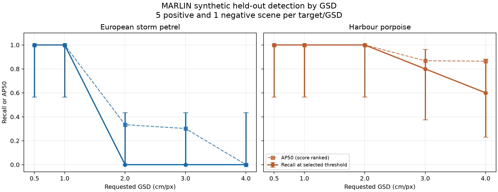
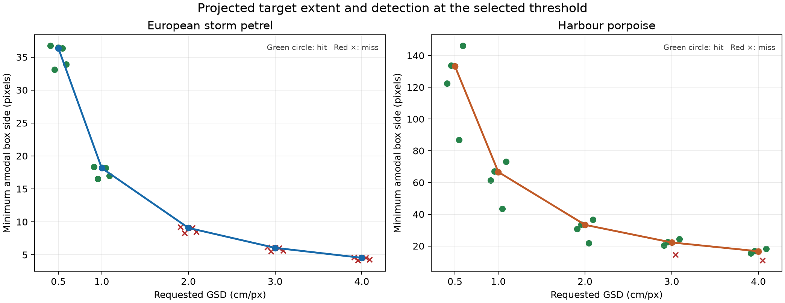

# MARLIN GSD pilot v1 — final sprint report

The eight-milestone sprint completed a traceable **synthetic-to-synthetic**
object-detection pilot for a European storm petrel and a harbour porpoise at
requested GSDs of 0.5, 1, 2, 3 and 4 cm/px. It demonstrated scene generation,
paired capture, ground-truth export, leakage-protected splitting, one detector
run, held-out evaluation and a live MARLIN demonstration. It did not establish
an operational survey GSD threshold.

## What the held-out detector did

The single TorchVision Faster R-CNN MobileNetV3-Large FPN detector trained for
20 epochs on 180 images. Pooled validation AP50 selected epoch 10 (0.8269),
and pooled validation F1 selected confidence threshold 0.947769. The same
threshold was applied to every GSD and target in the untouched 60-image test
split. At IoU ≥ 0.5, there were **32 TP, 2 FP and 18 FN** across 50 positive and
10 target-absent images. Precision was 0.941, recall 0.640 and AP50 0.772.
The 10 negative frames had no false detections at that threshold; both false
positives occurred in positive porpoise frames. The complete table and metric
definitions are in [M7 training evidence](../qa/M7_TRAINING.md).



The solid lines show recall at the one validation-selected confidence threshold;
the dashed lines show score-ranked AP50. Error bars are 95% Wilson intervals
for recall, with only five positive scene groups per species/GSD point. AP50
was calculated from predictions down to the locked 0.001 score floor and has
no interval in this chart. This difference explains why the petrel had nonzero
AP50 at 2 and 3 cm/px but zero detections at the selected threshold.

| Target | 0.5 cm/px | 1 cm/px | 2 cm/px | 3 cm/px | 4 cm/px |
| --- | ---: | ---: | ---: | ---: | ---: |
| Petrel recall, hits/5 | 5/5 | 5/5 | 0/5 | 0/5 | 0/5 |
| Porpoise recall, hits/5 | 5/5 | 5/5 | 5/5 | 4/5 | 3/5 |

For a cell with 5/5 hits, the Wilson 95% interval was **0.566–1.000**;
for 0/5 it was **0–0.434**. For porpoise 4/5 it was 0.376–0.964, and
for 3/5 it was 0.231–0.882. These broad ranges reflect the small held-out
set. The ten paired test scene groups yielded pooled recall 1.0 at 0.5 cm/px
and 0.3 at 4 cm/px. A 10,000-draw bootstrap that resampled whole scene groups
within species while keeping their five GSD outcomes together gave an observed
difference of −0.7 and a percentile range of **−0.9 to −0.5**. That range is
conditional on these ten synthetic groups; it does not cover variation from
unseen meshes, animals, seas, lighting or survey equipment and is not a
real-world confidence interval. The petrel's 1-to-2 cm/px drop occurred in
all five matched petrel groups, but five groups were far too few to set a
general threshold.

## Pixels on target



The image plots the **minimum side of the direct amodal bounding box**, not
the number of visible animal pixels or silhouette area. These box dimensions
were unchanged by M6 padding. Median minimum box side fell from 36.36 to
4.54 pixels for the petrel and from 133.24 to 16.66 pixels for the porpoise
between 0.5 and 4 cm/px. At the selected threshold, the five petrel boxes
near 9 pixels minimum side at 2 cm/px were all missed; three of five porpoise
boxes near 17 pixels at 4 cm/px were detected. This association does not
isolate pixel size as the cause: target shape, water appearance, pose and the
camera's changing world footprint also differed. Exact projected silhouette
area and visible target area remained unavailable.

## Evidence and scope

The accepted dataset comprised 50 scene groups (25 per target), 250 positive
RGB images with one direct amodal box each, and 50 target-absent counterparts.
All accepted images were checked for target visibility or absence and were
decoded and hashed before training. Scene, instance, sequence and condition
IDs stayed within one train, validation or test split; each scene's five GSD
views and negative counterparts stayed together. The original 1024 × 768
opaque RGBA captures were converted to RGB and padded vertically to
1024 × 1024 without cropping or resizing. The exact accepted image paths,
labels, split IDs, detector settings, scores and checkpoint hash are linked in
[M8 provenance](../qa/m8_provenance.json).

The MARLIN app and extension remained on the existing NVIDIA Omniverse Kit
architecture. The final Blender/ USD-capable service regression suite passed
77 tests; the reconstruction contract passed 8 tests. All earlier milestone
output hashes remained intact. The completion preview restored animated ocean
water and all 11 default animals swimming with body animation in the live
viewport, which was left running for visual inspection. The evidence is in
[M8 regression QA](../qa/m8_regression_validation.json) and
[M8 live preview](../qa/milestone_8_animation_preview.json).

Several parts of the experiment remained **provisional**. The camera was an
existing 1024 × 768 engineering pinhole profile with 50 mm focal length,
5 μm pixel pitch, nadir view and a flat reference plane; it was not a
calibrated survey camera. The GSD sweep moved the camera and changed the
world footprint rather than downsampling a fixed frame. The ocean and diffuse
lighting were fixed, and the petrel spread-wing proxy and shallow porpoise
pose did not cover full biological behaviour. Underwater porpoise boxes were
direct mesh projections, not refracted visible outlines. The source mesh for
each species was shared across splits, so the test did not establish
unseen-individual or unseen-mesh generalization. RGB bitwise replay identity,
actual RTX sample counts and exact visible target pixels were not established.
The native tiled path passed technical overlap and viewport-restoration checks
in M4, but its oblique image did not certify pilot target content; the
validated 1024 × 768 generic path supplied this dataset. External material
dependencies were recorded but not proven fully portable. The porpoise asset
record also retained its CC-BY-NC-4.0 licence, which should be reviewed before
any use outside this pilot.

## Reproduction map

The repository's [specification](../specification.json), [scene-group split](../splits/scene_groups.json),
[image assignments](../splits/image_assignments.json), [COCO annotations](../annotations/milestone_5_coco.json),
[detector lock](../ml/detector_lock.json), [training history](m7_training_history.json),
[validation selection](m7_validation_selection.json), [per-frame test predictions](m7_test_predictions.json),
and [test metrics](m7_test_metrics.json) form the trace from inputs to results.
`qa/milestone_8_manifest.json` hashes the final tracked package and checks
historical outputs. The selected model checkpoint was kept as an ignored local
artifact at `artifacts/gsd_pilot_v1_m7/best.pt`; its SHA-256 is recorded in
the test metrics and provenance, but its bytes are not in Git.

For a fresh checkout with the dataset and CUDA-capable host, create the
ignored experiment environment, install the pinned packages, verify the
loader and pretrained checkpoint, then run the fixed training script:

```bash
python3 -m venv artifacts/gsd_pilot_v1_m6/venv
artifacts/gsd_pilot_v1_m6/venv/bin/python -m pip install --no-cache-dir --extra-index-url https://download.pytorch.org/whl/cu126 -r experiments/gsd_pilot_v1/ml/requirements-cu126.lock
PYTHONDONTWRITEBYTECODE=1 artifacts/gsd_pilot_v1_m6/venv/bin/python experiments/gsd_pilot_v1/ml/verify_loader.py
PYTHONDONTWRITEBYTECODE=1 artifacts/gsd_pilot_v1_m6/venv/bin/python experiments/gsd_pilot_v1/ml/lock_detector.py
PYTHONDONTWRITEBYTECODE=1 artifacts/gsd_pilot_v1_m6/venv/bin/python experiments/gsd_pilot_v1/ml/train_evaluate.py
```

The checkpoint verifier downloads only the pinned official COCO_V1 weights
when absent and checks their complete SHA-256. The training script required
unchanged M6 split/lock hashes, saved resumable epoch state, and refused to
overwrite an existing held-out test report. A fresh checkout or preserved
copy of results is needed before repeating the completed run. Plot generation
used Matplotlib 3.11.2 in the ignored environment:

```bash
artifacts/gsd_pilot_v1_m6/venv/bin/python -m pip install matplotlib==3.11.2
PYTHONDONTWRITEBYTECODE=1 artifacts/gsd_pilot_v1_m6/venv/bin/python experiments/gsd_pilot_v1/results/m8_analyse.py
python3 -B experiments/gsd_pilot_v1/qa/m8_regressions.py
```

The tracked outputs, hashes and scripts made the workflow inspectable, but
they did not imply bitwise-equivalent reruns on other GPU, driver or Kit builds.
